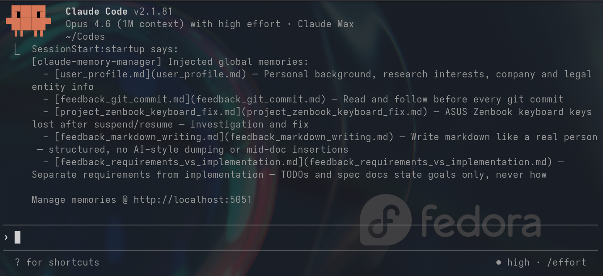
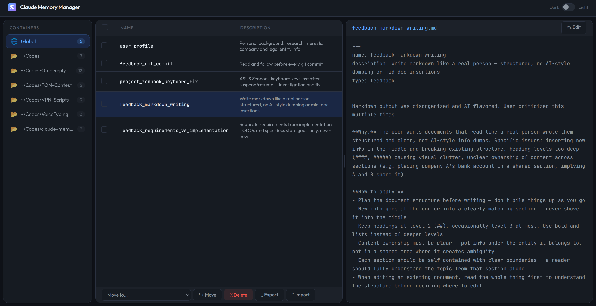

# Claude Memory Manager

## Background

Claude Code keeps memory files per project (`~/.claude/projects/<project>/memory/`). Two things are missing:

- **No global memory.** Fix Claude's behavior in project A, and project B still doesn't know about it. Settings have global and per-project tiers; memory only has per-project.
- **No way to see or manage memories.** Files are scattered under `~/.claude/`. You can't browse, edit, or clean them up without digging through directories by hand.

## What this does

Adds global memory and a web UI for managing all of Claude's memories.

<table>
<tr>
<td></td>
<td></td>
</tr>
<tr>
<td align="center">Global memories injected at session start</td>
<td align="center">Web UI for browsing and editing memories</td>
</tr>
</table>

**Global memory:**
- Keeps cross-project memories in `~/.claude/memory/`
- Injects them into context at session start via a SessionStart hook
- Includes a skill so Claude can read and write global memories during conversations

**Web UI** (default `localhost:5050`, picks another port if taken):
- Three-panel layout: folders, memory list, preview/edit
- Drag-and-drop between containers, bulk move/delete
- Export as `.zip`, import on another machine

## Install

In Claude Code, run `/plugin` → **Marketplaces** → **+ Add Marketplace**, enter:

```
WhymustIhaveaname/claude-memory-manager
```

Then go to **Discover** and install `claude-memory-manager`.

## Architecture

```
claude-memory-manager/
├── .claude-plugin/
│   ├── plugin.json         # Plugin manifest
│   └── marketplace.json    # Marketplace metadata
├── hooks/
│   └── hooks.json          # SessionStart hook config
├── scripts/
│   └── session-start.sh    # Install deps, start server, inject memories, print summary
├── skills/
│   └── manage-memory/
│       └── SKILL.md        # Tells Claude how to edit global memories
├── app.py                  # Flask routes → memory_ops
├── memory_ops.py           # Pure functions for all file operations
├── templates/              # Single-file frontend, inline CSS/JS
├── tests/                  # Unit + integration tests
```

Runtime data (not in the repo):

```
~/.claude/memory/                          # Global memory container
~/.claude-memory-manager/
└── logs/operations.jsonl                  # Write operation log
```

## TODO

- [ ] Timestamped knowledge files that naturally age and can be periodically pruned (ref: [yurukusa's comment](https://github.com/anthropics/claude-code/issues/34776#issuecomment-4064306947))
- [ ] Manage Claude Code `settings.json` in the web UI

## See also

- [thedotmack/claude-mem](https://github.com/thedotmack/claude-mem) — Persistent memory for Claude Code. Automatically preserves context across sessions with semantic search, vector database, and web UI
